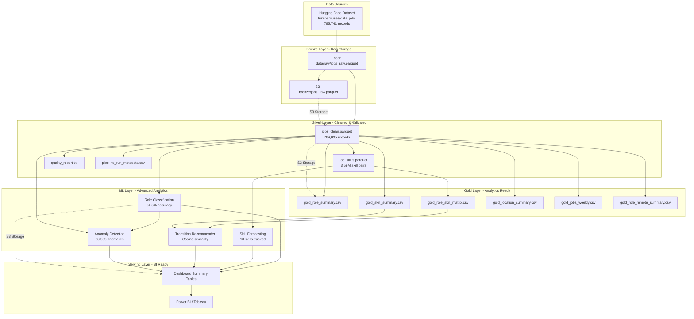
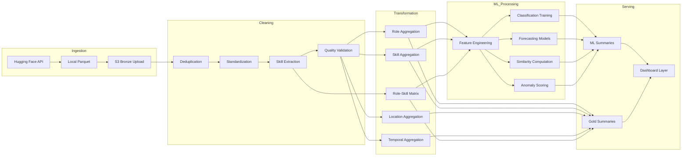

# Career Intelligence & Skills Transition Platform

**An end-to-end labor market intelligence system combining medallion-architecture data pipelines, AWS S3 storage, advanced analytics, and machine learning to transform 785K+ job postings into actionable career insights.**

---

## Overview

This platform analyzes large-scale job posting data to answer critical workforce intelligence questions:

- **Which data roles dominate the market?** Role demand analysis across analyst, engineer, and scientist positions
- **Which skills are foundational vs. emerging?** Skill demand tracking and time-series forecasting
- **What are the most realistic career transitions?** Data-driven transition recommendations with ranked skill gaps
- **Which job postings are anomalous or mislabeled?** Multi-signal anomaly detection combining business rules and ML

The system processes 785,741 raw job postings through a medallion-style pipeline (Bronze → Silver → Gold), generates analytics-ready summary tables, and powers four advanced ML modules that support job seekers, workforce planners, and hiring intelligence teams.

---

## Business Problem

The labor market for data professionals is complex and rapidly evolving. Job seekers struggle to:

- Identify which skills are most valuable for their target roles
- Understand realistic career transition paths based on skill overlap
- Detect emerging skill trends before they become saturated
- Navigate noisy job posting data with inconsistent labeling

This platform addresses these challenges by building a **data-driven career intelligence layer** on top of raw job market data, combining rigorous data engineering with advanced analytics and machine learning.

---

## Core Capabilities

### Data Engineering
- **Medallion-style pipeline** with Bronze (raw), Silver (cleaned), Gold (analytics-ready), and ML layers
- **Data quality validation** with duplicate detection, null analysis, and metadata tracking
- **AWS S3 integration** for scalable cloud storage across all pipeline layers
- **Batch ETL processing** handling 785K+ records with Parquet optimization

### Analytics
- **Role intelligence**: Demand, salary, remote work patterns, and company diversity by role
- **Skills intelligence**: Market demand, role-skill matrices, and co-occurrence patterns
- **Location intelligence**: Geographic distribution and remote-work concentration
- **Temporal analysis**: Weekly posting trends and time-series patterns

### Machine Learning
1. **Role Classification Engine**: Predicts role family from job text with 94.6% accuracy
2. **Emerging Skill Forecast Engine**: Time-series forecasting for top 10 skills with emerging signal detection
3. **Career Transition Recommender**: Cosine similarity-based transition recommendations with ranked skill gaps
4. **Job Posting Anomaly Detector**: Multi-signal anomaly detection combining rule-based and unsupervised methods

### Business Intelligence
- **Dashboard-ready summary tables** for executive, role, skill, transition, and anomaly insights
- **Six-page BI design** covering overview, role intelligence, skills, transitions, location, and predictive analytics

---

## Architecture Overview

The platform follows a **layered data architecture** designed for scalability, quality, and analytical flexibility:



---

## Data Flow

The pipeline transforms raw job postings into actionable intelligence through five distinct layers:



**Pipeline Execution Flow:**

1. **Ingestion**: Download dataset from Hugging Face → Save as Parquet → Upload to S3 Bronze
2. **Cleaning**: Remove 846 duplicates → Standardize location/salary fields → Extract 3.59M skill pairs → Validate quality
3. **Transformation**: Build 6 Gold summary tables → Create role-skill matrix → Generate weekly time series
4. **ML Processing**: Engineer features → Train 4 ML modules → Score predictions → Detect anomalies
5. **Serving**: Export dashboard summaries → Upload to S3 ML layer → Enable BI consumption

---

## Dataset

**Source**: `lukebarousse/data_jobs` (Hugging Face)

**Scale**:
- Raw records: 785,741
- Clean records: 784,895 (846 duplicates removed)
- Job-skill pairs: 3,591,106
- Unique skills: 252
- Unique roles: 8 (selected for ML)
- Date range: 2022-12-26 to 2023-12-25

**Schema** (17 columns):
- **Identifiers**: job_title, job_title_short, company_name
- **Location**: job_location, search_location, job_country
- **Work attributes**: job_work_from_home, job_schedule_type, job_type_skills
- **Compensation**: salary_year_avg, salary_hour_avg, salary_rate
- **Benefits**: job_health_insurance, job_no_degree_mention
- **Metadata**: job_posted_date, job_via
- **Skills**: job_skills (pipe-delimited)

**Storage**:
- Local: `data/raw/jobs_raw.parquet`
- S3: `s3://career-intelligence-data-platform/bronze/jobs_raw.parquet`

---

## Pipeline Layers

### Bronze Layer: Raw Preservation

**Purpose**: Immutable source-of-truth storage

**Outputs**:
- `jobs_raw.parquet` (785,741 records, 17 columns)

**Storage**:
- Local: `data/raw/`
- S3: `s3://career-intelligence-data-platform/bronze/`

---

### Silver Layer: Cleaned & Validated

**Purpose**: Production-quality cleaned data with quality controls

**Processing Steps**:
1. **Deduplication**: Remove 846 duplicate job postings based on composite key
2. **Standardization**: Clean location strings, normalize salary fields, standardize boolean flags
3. **Skill extraction**: Parse pipe-delimited skill strings into normalized job-skill pairs
4. **Quality validation**: Check for nulls, duplicates, empty values, and critical field coverage
5. **Metadata tracking**: Record row counts, duplicates removed, outputs generated, run status

**Outputs**:

| File | Records | Columns | Purpose |
|------|---------|---------|----------|
| `jobs_clean.parquet` | 784,895 | 18 | Cleaned job records with job_key |
| `job_skills.parquet` | 3,591,106 | 2 | Job-skill pairs (job_key, skill) |
| `quality_report.txt` | - | - | Validation metrics and null analysis |
| `pipeline_run_metadata.csv` | 1 | 8 | Run timestamp, counts, status |

**Quality Highlights**:
- ✅ Zero duplicate job_key values in clean dataset
- ✅ Zero duplicate job_key-skill pairs
- ✅ Zero null or empty skills in skill table
- ✅ Critical nulls (job_title_short, job_posted_date) < 0.1%
- ⚠️ Salary fields sparse but usable (year_avg: 22% coverage, hour_avg: 3% coverage)

**Storage**:
- Local: `data/processed/`
- S3: `s3://career-intelligence-data-platform/silver/`

---

### Gold Layer: Analytics-Ready Summaries

**Purpose**: Business-ready aggregations optimized for analytics and BI

**Outputs**:

#### 1. `gold_role_summary.csv`
One row per role with demand, remote work, salary, and diversity metrics.

**Columns**:
- `job_title_short`, `total_jobs`, `remote_jobs`, `remote_pct`
- `avg_salary_year`, `median_salary_year`, `avg_salary_hour`
- `unique_companies`, `unique_locations`

#### 2. `gold_location_summary.csv`
One row per location with job volume, remote patterns, and role diversity.

**Columns**:
- `job_location_clean`, `total_jobs`, `remote_jobs`, `remote_pct`
- `unique_roles`, `unique_companies`

**Note**: "Anywhere" remapped to "Remote / Anywhere" for clarity.

#### 3. `gold_skill_summary.csv`
One row per skill with total demand, role diversity, and company reach.

**Columns**:
- `skill`, `total_demand`, `unique_roles`, `unique_companies`

#### 4. `gold_role_skill_matrix.csv`
Role-skill demand matrix for co-occurrence analysis.

**Columns**:
- `job_title_short`, `skill`, `demand_count`

#### 5. `gold_jobs_weekly.csv`
Weekly job posting volume for time-series analysis.

**Columns**:
- `week_start`, `job_count`

#### 6. `gold_role_remote_summary.csv`
Role-level remote vs. non-remote breakdown.

**Columns**:
- `job_title_short`, `work_mode`, `job_count`, `percentage`

**Storage**:
- Local: `data/processed/gold/`
- S3: `s3://career-intelligence-data-platform/gold/`

---

### ML Layer: Advanced Analytics

**Purpose**: Machine learning outputs for classification, forecasting, recommendations, and anomaly detection

**Storage**:
- Local: `data/exports/`, `data/ml_ready/`, `models/`
- S3: `s3://career-intelligence-data-platform/ml/`

---

### Serving Layer: Dashboard Summaries

**Purpose**: Pre-aggregated tables optimized for BI tool consumption

**Outputs**:
- `ml_summary_classification.csv`: Classification performance and prediction agreement
- `ml_summary_emerging_skills.csv`: Emerging skill signals with growth metrics
- `ml_summary_anomaly_counts.csv`: Anomaly counts by reason
- `ml_summary_top_transitions.csv`: Top role similarity pairs and transition paths

**Storage**:
- Local: `data/exports/dashboard/`
- S3: `s3://career-intelligence-data-platform/ml/summaries/`

---

## Exploratory Data Analysis

Key insights from the Gold layer that informed ML development:

### Role Distribution
- **Top 3 roles**: Data Analyst, Data Engineer, Data Scientist
- **Seniority patterns**: Senior roles represent ~15-20% of their base role volume
- **Specialization**: Business Analyst and Software Engineer show distinct skill profiles

### Skills Landscape
- **Most demanded overall**: SQL (dominant), Python, AWS, Azure, Tableau
- **BI/Reporting tools**: Excel, Power BI, Tableau show strong demand across analyst roles
- **Engineering tools**: Spark, Java, distributed processing frameworks concentrate in engineering roles
- **Cloud platforms**: AWS leads, followed by Azure; multi-cloud skills common

### Role-Skill Patterns
- **Data Analysts**: SQL, Excel, Tableau, Python, Power BI
- **Data Engineers**: SQL, Python, AWS, Spark, Azure
- **Data Scientists**: Python, SQL, R, AWS, Spark
- **Skill co-occurrence**: Employers hire tool combinations, not isolated skills (e.g., SQL + Python + Cloud)

### Remote Work
- **Overall**: Dataset is heavily non-remote (~80%)
- **Role variation**: Some roles show higher remote percentages than others
- **Location patterns**: "Remote / Anywhere" is a significant category

### Salary Distribution
- **Coverage**: ~22% of postings include year_avg salary
- **Distribution**: Right-skewed with senior technical roles commanding higher compensation
- **Role patterns**: Data Scientists and Senior Engineers trend higher than Analyst roles

### Temporal Patterns
- **Weekly trends**: Posting volume shows weekly seasonality suitable for forecasting
- **Date range**: 52 weeks of data (2022-12-26 to 2023-12-25)
- **Stability**: Core skills show relatively stable demand; some BI tools show growth signals

---

## Machine Learning Modules

### 1. Role Classification Engine

**Objective**: Predict role family from job posting text and metadata to enable role mismatch detection.

#### Feature Engineering

**Feature table**: `feature_role_classification.csv` (758,502 rows × 9 columns)

**Selected role classes** (8 roles):
- Data Analyst
- Data Engineer  
- Data Scientist
- Business Analyst
- Software Engineer
- Senior Data Engineer
- Senior Data Scientist
- Senior Data Analyst

**Features**:
- `text_blob`: Combined text from job_title + job_type_skills + job_location_clean
- `job_work_from_home`: Boolean remote flag
- `job_no_degree_mention`: Boolean degree requirement flag
- `job_health_insurance`: Boolean benefits flag
- `salary_year_avg`: Annual salary (sparse)
- `salary_hour_avg`: Hourly salary (sparse)
- `salary_rate`: Salary type indicator

#### Model Development

**Initial benchmarking**:
- Logistic Regression (TF-IDF + metadata)
- Linear SVM (TF-IDF + metadata)
- Random Forest with SVD (dimensionality reduction)

**Key finding**: Role taxonomy is primarily text-driven. Salary and boolean metadata added minimal predictive value.

**Refinement round**:
- Refined Logistic Regression
- **Text-only Linear SVM** ← Best performer
- Refined Random Forest with SVD

#### Best Model: Text-Only Linear SVM

**Performance**:
- **Accuracy**: 94.55%
- **Macro Precision**: 91.77%
- **Macro Recall**: 93.85%
- **Macro F1**: 92.76%

**Interpretation**: Role identity is primarily carried by title and skill language rather than compensation or benefits metadata. Restricting to pure TF-IDF text features improved generalization.

#### Outputs

**Model artifact**: `models/classification/best_role_classifier_refined.joblib`

**Predictions**: `ml_role_predictions.csv` (758,502 rows × 4 columns)
- `job_key`, `actual_role`, `predicted_role`, `correct_prediction`
- **Correct predictions**: 727,998 (95.98%)
- **Incorrect predictions**: 30,504

**Top confusion patterns**:
- Data Analyst → Data Scientist (2,807)
- Data Analyst → Senior Data Analyst (2,505)
- Data Scientist → Data Analyst (2,431)
- Data Analyst → Business Analyst (2,247)
- Data Scientist → Senior Data Scientist (1,852)

**Insight**: Most confusion occurs between adjacent roles (e.g., base vs. senior, analyst vs. scientist), reflecting genuine ambiguity in job posting language.

---

### 2. Emerging Skill Forecast Engine

**Objective**: Forecast weekly demand for top skills and generate emerging vs. stable skill signals.

#### Feature Engineering

**Feature table**: `feature_skill_weekly.csv` (530 rows × 3 columns)
- `week_start`, `skill`, `demand_count`

**Forecast skills** (top 10 by demand):
- sql, python, aws, azure, r, tableau, excel, spark, power bi, java

**Time range**: 53 weeks (2022-12-26 to 2023-12-25)

#### Model Development

**Approach**: Univariate time-series forecasting per skill

**Test setup**:
- Last 12 weeks held out as test horizon
- Models compared: Naive baseline, Exponential Smoothing, ARIMA

**Best model**: **Exponential Smoothing** (best overall performance across most skills)

#### Outputs

**Forecast comparison**: `forecast_model_comparison.csv`
- Model performance metrics per skill

**Forecasts**: `ml_skill_forecasts.csv` (360 rows × 5 columns)
- `skill`, `week_start`, `actual_count`, `forecast_count`, `model_name`

#### Emerging Skill Signal Detection

**Signal table**: `ml_emerging_skills.csv` (10 rows × 8 columns)

**Columns**:
- `skill`
- `prior_4wk_actual_avg`: Average demand 8-5 weeks ago
- `last_4wk_actual_avg`: Average demand last 4 weeks
- `next_4wk_forecast_avg`: Forecasted average next 4 weeks
- `recent_growth_pct`: Recent growth rate
- `forecast_growth_pct`: Forecasted growth rate
- `emerging_score`: Combined growth signal
- `signal_label`: Emerging / Stable / Declining

**Threshold adjustment**: Signal thresholds adjusted from ±5% to ±2% to better capture meaningful short-term movement among mature high-demand skills.

**Results**:

**Emerging skills** (positive growth signals):
- tableau
- power bi
- excel
- r

**Stable skills** (mature, steady demand):
- sql
- python
- aws
- spark
- azure
- java

**Interpretation**: Core technical skills (SQL, Python, cloud) show stable demand, while BI/reporting and statistical analysis tools show near-term upward momentum.

---

### 3. Career Transition Recommender

**Objective**: Recommend realistic role transitions with ranked skill gaps based on role similarity and skill importance.

#### Methodology

**Inputs**:
- `gold_role_skill_matrix.csv`: Role-skill demand counts
- `gold_skill_summary.csv`: Market-level skill demand
- `ml_emerging_skills.csv`: Emerging skill signals

**Role vector construction**:
1. Build weighted role-skill vectors from role-skill matrix
2. Normalize `role_skill_weight` within each role (sum to 1)
3. Compute cosine similarity between all role pairs

**Role vectors**: `feature_role_skill_vectors.csv`

#### Role Similarity

**Similarity matrix**: `ml_role_similarity.csv`

**Example high-similarity pairs**:
- Business Analyst → Data Analyst: **0.9770**
- Business Analyst → Senior Data Analyst: **0.9336**
- Business Analyst → Data Scientist: 0.6903
- Business Analyst → Data Engineer: 0.6208

**Interpretation**: Analyst roles share high skill overlap; transitions to engineering or science roles require more significant skill development.

#### Transition Recommendations

**Output**: `ml_transition_recommendations.csv`

**Logic**:
1. For each source-target role pair, identify top 15 weighted skills per role
2. Compute `shared_skills` (overlap) and `missing_skills` (gap)
3. Rank `missing_skills` using composite score:

**Recommendation score formula**:
```
0.5 × role_skill_weight
+ 0.3 × normalized_market_demand  
+ 0.2 × normalized_emerging_score
```

**Rationale**: Prioritize skills that are (1) important to the target role, (2) broadly demanded in the market, and (3) showing emerging growth signals.

**Example transitions**:

**Business Analyst → Data Analyst**:
- High similarity (0.977)
- Shared skills: SQL, Excel, Tableau, Python
- Recommended next skills: Power BI, R, SAS (ranked by composite score)

**Data Analyst → Data Scientist**:
- Moderate similarity (0.69)
- Shared skills: Python, SQL, R
- Recommended next skills: Spark, machine learning libraries, statistical modeling tools

**Cloud Engineer → Data Engineer**:
- Moderate similarity
- Shared skills: AWS, Python, cloud infrastructure
- Recommended next skills: SQL, Spark, data pipeline tools

**Value**: Provides data-driven, personalized learning roadmaps based on actual market skill patterns.

---

### 4. Job Posting Anomaly Detector

**Objective**: Flag unusual job postings using multi-signal anomaly detection combining business rules and unsupervised ML.

#### Feature Engineering

**Feature table**: `feature_job_anomalies.csv` (784,895 rows × 18 columns)

**Engineered features**:

**Role mismatch**:
- `actual_role`: Original job_title_short
- `predicted_role`: Classification model prediction
- `role_disagreement_flag`: actual ≠ predicted

**Salary outliers**:
- `salary_year_avg`: Posting salary
- `role_median_salary_year`: Median salary for role
- `salary_deviation_from_role_median`: Absolute deviation
- `salary_ratio_to_role_median`: Ratio
- `salary_anomaly_flag`: Extreme deviation (>2 std dev or ratio >2x)

**Skill count outliers**:
- `job_skill_count`: Number of skills in posting
- `role_median_skill_count`: Median skill count for role
- `skill_count_deviation_from_role_median`: Absolute deviation
- `skill_count_ratio_to_role_median`: Ratio
- `skill_count_anomaly_flag`: Extreme deviation (>2 std dev or ratio >2x)

#### Rule-Based Anomaly Flags

**Summary**:
- **Role disagreement**: 56,897 postings (7.2%)
- **Salary anomaly**: 2,737 postings (0.3%)
- **Skill count anomaly**: 425,904 postings (54.3%)

**Interpretation**: Skill count anomaly is broad and acts as a structural signal rather than a definitive anomaly verdict. Most value comes from combining multiple signals.

#### Unsupervised Anomaly Detection

**Model**: Isolation Forest
- `contamination=0.05` (expect ~5% anomalies)
- Trained on normalized feature set

#### Final Anomaly Output

**Export**: `ml_posting_anomalies.csv` (38,305 anomalous postings)

**Anomaly reason distribution**:
- Role disagreement + Skill count outlier: 16,030 (41.8%)
- Role disagreement only: 14,056 (36.7%)
- Skill count outlier only: 5,225 (13.6%)
- Salary outlier + Skill count outlier: 1,235 (3.2%)
- Salary outlier only: 1,109 (2.9%)
- Model-detected anomaly: 257 (0.7%)
- Role disagreement + Salary outlier + Skill count outlier: 214 (0.6%)
- Role disagreement + Salary outlier: 179 (0.5%)

**Example anomalies**:

1. **Technical Data Architect - Healthcare**
   - Labeled: Data Analyst
   - Predicted: Senior Data Engineer
   - Salary: Very high
   - Skill count: Very high
   - **Reason**: Likely mislabeled; architecture role misclassified as analyst

2. **Staff DevOps Engineer - Big Data - Hadoop - Federal - 2nd Shift**
   - Labeled: Data Engineer
   - Predicted: Software Engineer
   - **Reason**: DevOps/infrastructure role mislabeled as data engineering

3. **Senior Data Scientist**
   - Salary: Extremely high (>3x role median)
   - Skill count: Very high (>2x role median)
   - **Reason**: Possible executive-level or specialized role with inflated requirements

**Value**: Combines interpretable business-rule signals with model-based anomaly scoring, making it more practical and explainable than pure black-box detection.

---

## Dashboard Design

The platform includes a **six-page Power BI dashboard** designed for executive, recruiter, and job seeker audiences.

### Page 1: Executive Overview

**KPIs**:
- Total jobs: 784,895
- Total unique companies
- Total unique locations
- Total unique skills: 252
- Remote job percentage

**Visuals**:
- Top job roles (bar chart)
- Top skills overall (bar chart)
- Weekly posting trend (line chart)
- Remote vs. non-remote split (pie chart)

**Purpose**: High-level market snapshot

---

### Page 2: Role Intelligence

**Visuals**:
- Role volume (bar chart)
- Median salary by role (bar chart)
- Remote percentage by role (bar chart)
- Unique companies by role (bar chart)

**Filters**: Role, date range

**Purpose**: Role-level demand, compensation, and diversity analysis

---

### Page 3: Skills Intelligence

**Visuals**:
- Top skills overall (bar chart)
- Role-skill heatmap (matrix)
- Grouped role-skill comparisons (clustered bar chart)
- Emerging skills callout (card visual with growth metrics)

**Filters**: Role, skill category

**Purpose**: Skill demand patterns and emerging skill signals

---

### Page 4: Career Transition Insights

**Visuals**:
- Top role similarity pairs (table with similarity scores)
- Transition recommendations (matrix: source role → target role → top 5 recommended skills)
- Recommended next skills (ranked list with composite scores)

**Filters**: Source role, target role

**Purpose**: Data-driven career transition planning

---

### Page 5: Work Mode & Location Intelligence

**Visuals**:
- Remote vs. non-remote by role (stacked bar chart)
- Top locations by job volume (bar chart)
- Remote-heavy locations (bar chart: remote %)
- Role diversity by location (scatter plot: job volume vs. unique roles)

**Filters**: Location, work mode

**Purpose**: Geographic and remote work pattern analysis

---

### Page 6: Predictive & Quality Intelligence

**Visuals**:
- Weekly skill forecast trends (line chart: actual vs. forecast for top skills)
- Anomaly counts by reason (bar chart)
- Classification agreement rate (gauge: 95.98%)
- Example anomalous postings (table with reason, actual role, predicted role, salary, skill count)

**Filters**: Skill, anomaly reason

**Purpose**: ML insights and data quality monitoring

---

### Dashboard Summary Tables

Pre-aggregated tables optimized for BI consumption:

- `ml_summary_classification.csv`: Model performance and prediction agreement
- `ml_summary_emerging_skills.csv`: Emerging skill signals with growth metrics
- `ml_summary_anomaly_counts.csv`: Anomaly counts by reason
- `ml_summary_top_transitions.csv`: Top role similarity pairs

**Storage**: `s3://career-intelligence-data-platform/ml/summaries/`

---

## AWS S3 Storage Structure

The platform uses **S3 as the primary cloud storage layer** with a medallion-style folder structure:

```
s3://career-intelligence-data-platform/
├── bronze/
│   └── jobs_raw.parquet                    # Raw source data (785,741 records)
│
├── silver/
│   ├── jobs_clean.parquet                  # Cleaned jobs (784,895 records)
│   ├── job_skills.parquet                  # Job-skill pairs (3.59M pairs)
│   ├── quality_report.txt                  # Validation metrics
│   └── pipeline_run_metadata.csv           # Run tracking
│
├── gold/
│   ├── gold_role_summary.csv               # Role-level analytics
│   ├── gold_location_summary.csv           # Location-level analytics
│   ├── gold_skill_summary.csv              # Skill-level analytics
│   ├── gold_role_skill_matrix.csv          # Role-skill demand matrix
│   ├── gold_jobs_weekly.csv                # Weekly time series
│   └── gold_role_remote_summary.csv        # Remote work breakdown
│
└── ml/
    ├── ml_role_predictions.csv             # Classification predictions
    ├── ml_skill_forecasts.csv              # Skill demand forecasts
    ├── ml_emerging_skills.csv              # Emerging skill signals
    ├── ml_role_similarity.csv              # Role similarity matrix
    ├── ml_transition_recommendations.csv   # Transition recommendations
    ├── ml_posting_anomalies.csv            # Anomaly detections
    └── summaries/
        ├── ml_summary_classification.csv
        ├── ml_summary_emerging_skills.csv
        ├── ml_summary_anomaly_counts.csv
        └── ml_summary_top_transitions.csv
```

**Benefits**:
- **Scalability**: Cloud-native storage for large datasets
- **Durability**: S3 11 9's durability
- **Accessibility**: Enables cross-team data sharing
- **Cost-efficiency**: Pay-per-use storage with lifecycle policies

---

## Project Structure

```
career-intelligence-data-platform/
├── data/
│   ├── raw/                                # Bronze layer (local)
│   │   └── jobs_raw.parquet
│   ├── processed/                          # Silver & Gold layers (local)
│   │   ├── jobs_clean.parquet
│   │   ├── job_skills.parquet
│   │   ├── quality_report.txt
│   │   ├── pipeline_run_metadata.csv
│   │   └── gold/
│   ├── ml_ready/                           # ML feature tables
│   │   ├── feature_role_classification.csv
│   │   ├── feature_skill_weekly.csv
│   │   ├── feature_role_skill_vectors.csv
│   │   └── feature_job_anomalies.csv
│   └── exports/                            # ML outputs & dashboard summaries
│       ├── ml_role_predictions.csv
│       ├── ml_skill_forecasts.csv
│       ├── ml_emerging_skills.csv
│       ├── ml_role_similarity.csv
│       ├── ml_transition_recommendations.csv
│       ├── ml_posting_anomalies.csv
│       └── dashboard/
│
├── notebooks/                              # Jupyter notebooks for exploration
│   ├── 01_data_ingestion.ipynb
│   ├── 02_data_cleaning.ipynb
│   ├── 03_eda.ipynb
│   ├── 04_gold_layer.ipynb
│   ├── 05_ml_classification.ipynb
│   ├── 06_ml_forecasting.ipynb
│   ├── 07_ml_recommendation.ipynb
│   └── 08_ml_anomaly_detection.ipynb
│
├── src/                                    # Production Python modules
│   ├── ingestion/
│   │   ├── download_data.py
│   │   └── upload_to_s3.py
│   ├── processing/
│   │   ├── clean_jobs.py
│   │   ├── extract_skills.py
│   │   └── quality_checks.py
│   ├── features/
│   │   ├── build_gold_layer.py
│   │   └── build_ml_features.py
│   └── ml/
│       ├── classification/
│       │   ├── train_classifier.py
│       │   └── predict_roles.py
│       ├── forecasting/
│       │   ├── train_forecasts.py
│       │   └── detect_emerging.py
│       ├── recommendation/
│       │   ├── compute_similarity.py
│       │   └── recommend_transitions.py
│       └── anomaly_detection/
│           └── detect_anomalies.py
│
├── models/                                 # Trained model artifacts
│   └── classification/
│       └── best_role_classifier_refined.joblib
│
├── outputs/                                # Charts and analysis outputs
│   ├── charts/
│   └── ml/
│       └── forecast_model_comparison.csv
│
├── docs/                                   # Additional documentation
│
├── README.md                               # This file
├── requirements.txt                        # Python dependencies
└── .gitignore
```

---

## Key Results & Metrics

### Data Engineering
- ✅ **785,741 raw records** ingested from Hugging Face
- ✅ **846 duplicates removed** (0.11% of dataset)
- ✅ **784,895 clean records** in Silver layer
- ✅ **3,591,106 job-skill pairs** extracted
- ✅ **252 unique skills** identified
- ✅ **6 Gold summary tables** generated
- ✅ **Zero critical data quality issues** in final dataset

### Machine Learning

**Role Classification**:
- ✅ **94.55% accuracy** (text-only Linear SVM)
- ✅ **95.98% prediction agreement** on full dataset
- ✅ **92.76% macro F1** across 8 role classes

**Skill Forecasting**:
- ✅ **10 skills forecasted** with weekly granularity
- ✅ **Exponential Smoothing** best overall model
- ✅ **4 emerging skills identified** (Tableau, Power BI, Excel, R)
- ✅ **6 stable skills identified** (SQL, Python, AWS, Spark, Azure, Java)

**Career Transitions**:
- ✅ **Cosine similarity-based** role matching
- ✅ **Composite scoring** for skill recommendations (role importance + market demand + emerging signal)
- ✅ **Realistic transition paths** identified (e.g., Business Analyst → Data Analyst: 0.977 similarity)

**Anomaly Detection**:
- ✅ **38,305 anomalous postings** detected (4.9% of dataset)
- ✅ **Multi-signal approach** combining role mismatch, salary outliers, skill count outliers, and Isolation Forest
- ✅ **Interpretable anomaly reasons** for explainability

### Business Intelligence
- ✅ **6-page dashboard design** covering executive, role, skill, transition, location, and predictive insights
- ✅ **4 ML summary tables** for dashboard consumption
- ✅ **S3-backed serving layer** for scalable BI access

---

## Skills Demonstrated

This project showcases the following technical and analytical competencies relevant to **Data Engineer, Data Analyst, BI Analyst, Data Scientist, and ML/Applied AI roles**:

### Data Engineering
- **Python**: End-to-end pipeline development with pandas, scikit-learn, statsmodels
- **ETL/ELT**: Medallion-style pipeline (Bronze → Silver → Gold → ML → Serving)
- **Data ingestion**: Hugging Face API integration, Parquet file handling
- **Data transformation**: Cleaning, deduplication, standardization, skill extraction
- **Data validation**: Quality checks, null analysis, duplicate detection, metadata tracking
- **Batch pipelines**: Multi-stage processing with clear layer separation
- **AWS S3**: Cloud storage integration with boto3
- **Data modeling**: Star schema thinking for analytics-ready tables
- **Data governance**: Quality reporting, run metadata, immutable Bronze layer

### Data Analytics
- **SQL concepts**: Aggregation logic, join patterns, window functions (conceptual)
- **Exploratory data analysis**: Role, skill, location, temporal, and salary pattern analysis
- **KPI reporting**: Summary metrics for roles, skills, locations, and time series
- **Data visualization thinking**: Dashboard design with executive, operational, and analytical views
- **Business intelligence**: Analytics-ready table design for BI tool consumption

### Machine Learning
- **Feature engineering**: Text features (TF-IDF), temporal features, ratio features, deviation features
- **Classification**: Multi-class role prediction with Logistic Regression, SVM, Random Forest
- **Time-series forecasting**: Exponential Smoothing, ARIMA, naive baselines
- **Recommendation systems**: Cosine similarity, weighted scoring, composite ranking
- **Anomaly detection**: Isolation Forest, rule-based detection, multi-signal fusion
- **Model evaluation**: Accuracy, precision, recall, F1, confusion matrix analysis
- **Statistical modeling**: Deviation analysis, outlier detection, normalization
- **Predictive modeling**: Supervised and unsupervised learning

### Software Engineering & Collaboration
- **Git/GitHub**: Version control, professional README documentation
- **Code organization**: Modular src/ structure with clear separation of concerns
- **Documentation**: Comprehensive technical writing for portfolio and hiring audiences
- **Analytics communication**: Translating technical results into business insights

---

## How to Run

### Prerequisites

- Python 3.8+
- AWS account with S3 access (optional for cloud storage)
- AWS CLI configured (optional)

### Installation

```bash
# Clone repository
git clone https://github.com/yourusername/career-intelligence-data-platform.git
cd career-intelligence-data-platform

# Create virtual environment
python -m venv venv
source venv/bin/activate  # On Windows: venv\Scripts\activate

# Install dependencies
pip install -r requirements.txt
```

### Execution Flow

**1. Data Ingestion**
```bash
python src/ingestion/download_data.py
python src/ingestion/upload_to_s3.py --layer bronze
```

**2. Data Cleaning & Silver Layer**
```bash
python src/processing/clean_jobs.py
python src/processing/extract_skills.py
python src/processing/quality_checks.py
python src/ingestion/upload_to_s3.py --layer silver
```

**3. Gold Analytics Layer**
```bash
python src/features/build_gold_layer.py
python src/ingestion/upload_to_s3.py --layer gold
```

**4. ML Feature Engineering**
```bash
python src/features/build_ml_features.py
```

**5. ML Module Execution**
```bash
# Classification
python src/ml/classification/train_classifier.py
python src/ml/classification/predict_roles.py

# Forecasting
python src/ml/forecasting/train_forecasts.py
python src/ml/forecasting/detect_emerging.py

# Recommendation
python src/ml/recommendation/compute_similarity.py
python src/ml/recommendation/recommend_transitions.py

# Anomaly Detection
python src/ml/anomaly_detection/detect_anomalies.py
```

**6. Upload ML Outputs**
```bash
python src/ingestion/upload_to_s3.py --layer ml
```

**Alternative: Jupyter Notebooks**

Run notebooks sequentially in `notebooks/` for interactive exploration:
1. `01_data_ingestion.ipynb`
2. `02_data_cleaning.ipynb`
3. `03_eda.ipynb`
4. `04_gold_layer.ipynb`
5. `05_ml_classification.ipynb`
6. `06_ml_forecasting.ipynb`
7. `07_ml_recommendation.ipynb`
8. `08_ml_anomaly_detection.ipynb`

---

## Future Improvements

### Data Engineering
- **Incremental processing**: Add change data capture for daily/weekly updates
- **PySpark migration**: Scale to larger datasets with distributed processing
- **Data quality monitoring**: Automated alerts for quality threshold violations
- **Schema evolution**: Version control for data schemas

### Analytics
- **Salary imputation**: ML-based salary prediction for sparse records
- **Skill taxonomy**: Hierarchical skill grouping (e.g., "Python" → "Programming Languages")
- **Company intelligence**: Employer-level analytics and hiring pattern detection

### Machine Learning
- **Deep learning classification**: BERT-based role classification for improved accuracy
- **Multi-step forecasting**: Extend forecast horizon beyond 4 weeks
- **Causal inference**: Estimate impact of skill acquisition on salary/role transitions
- **Real-time anomaly detection**: Streaming anomaly detection for new postings

### Infrastructure
- **Orchestration**: Airflow or Prefect for pipeline scheduling
- **Containerization**: Docker for reproducible environments
- **CI/CD**: Automated testing and deployment pipelines
- **Data catalog**: Metadata management with AWS Glue or DataHub

### Business Intelligence
- **Interactive dashboard**: Deploy Power BI or Tableau dashboard to cloud
- **API layer**: REST API for programmatic access to insights
- **User personalization**: Customized recommendations based on user profile

---

## Why This Project Matters for Hiring

This platform demonstrates **end-to-end data capabilities** that hiring managers value:

### For Data Engineer Roles
- **Production-quality pipelines**: Medallion architecture with clear layer separation
- **Cloud integration**: AWS S3 storage with scalable design
- **Data quality focus**: Validation, metadata tracking, and quality reporting
- **Scalability thinking**: Parquet optimization, modular code, future PySpark migration path

### For Data Analyst / BI Analyst Roles
- **Analytics-ready data**: Gold layer designed for BI consumption
- **KPI development**: Business metrics across roles, skills, locations, and time
- **Dashboard design**: Six-page BI design with executive and operational views
- **Insight generation**: Translating data patterns into actionable intelligence

### For Data Scientist / ML Roles
- **Multiple ML techniques**: Classification, forecasting, recommendation, anomaly detection
- **Feature engineering**: Text, temporal, ratio, and deviation features
- **Model evaluation**: Rigorous benchmarking and performance analysis
- **Business-driven ML**: Models designed to answer real-world questions, not just maximize metrics

### Cross-Functional Value
- **Real-world problem**: Labor market intelligence is a genuine business need
- **Complete solution**: Not just analysis, but a full platform from ingestion to serving
- **Professional documentation**: Portfolio-ready README and code organization
- **Scalable design**: Built with growth and production deployment in mind

---

## License

MIT License - see LICENSE file for details.

---

## Contact

For questions about this project or collaboration opportunities, please reach out via [GitHub](https://github.com/yourusername) or [LinkedIn](https://linkedin.com/in/yourprofile).

---

**Built with**: Python • pandas • scikit-learn • statsmodels • boto3 • AWS S3 • Jupyter • Power BI